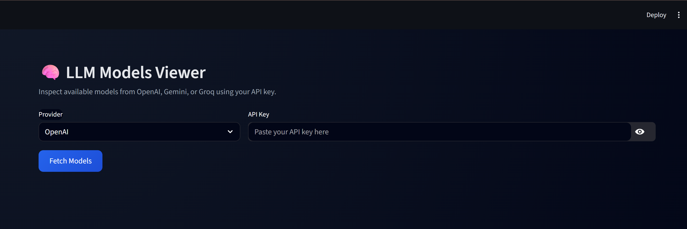
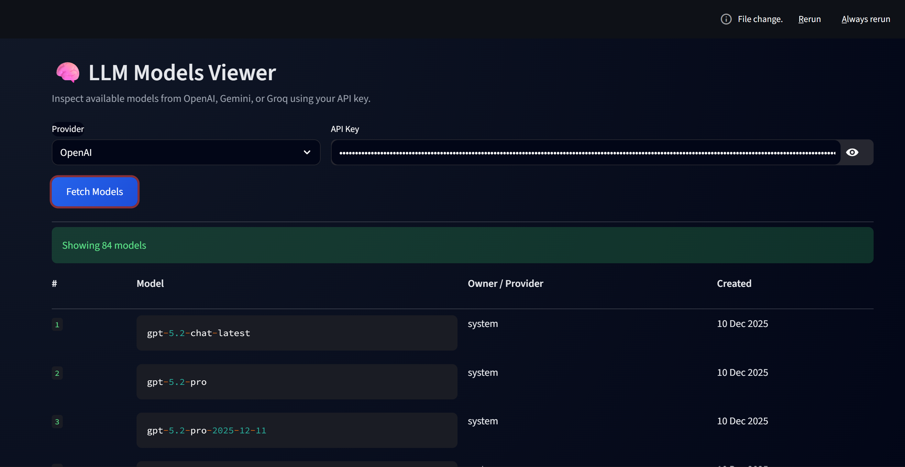

# 🧠 LLM Models Viewer

[](https://api-model-avaiable-checker.streamlit.app/)


### *One dashboard to explore LLM models across providers — fast, clean, and SDK-free.*


## ⭐ Why this project?

LLM platforms evolve fast.
New models are released, old ones get deprecated, and dashboards differ across providers.

**LLM Models Viewer** gives you a **single, clean interface** to:

* See **all available models instantly**
* Compare models across **OpenAI, Gemini, and Groq**
* Identify **newest models first**
* Search and filter models by name
* Avoid SDK setup, `.env` files, or provider lock-in

This is a **developer-first utility**, built to be practical, fast, and readable.


## ✨ Key Features

* 🔍 **Unified model explorer** (OpenAI / Gemini / Groq)
* 🗂 **Sorted by latest → oldest**
* 📊 **Column-based professional layout**
* 🎨 **Clean, dashboard-style UI**
* 🔐 **API keys never stored**
* ⚡ **Raw REST APIs (no SDKs required)**


## 🖼 Screenshots





## 🚀 Getting Started

### Requirements

* Python **3.9+**
* Internet connection
* API key from at least one provider:

  * OpenAI
  * Groq
  * Google Gemini

### Install dependencies

```bash
pip install streamlit requests
```

### Run the app

```bash
streamlit run ai_model_checker.py
```

Open the local URL shown in your terminal.

## 🌐 Live Demo

Try the app live here:  
👉 https://api-model-avaiable-checker.streamlit.app/


## 🧪 How to Use

1. Select a provider (OpenAI / Gemini / Groq)
2. Paste your API key
3. Click **Fetch Models**
4. Models are shown **newest → oldest**

That’s it — no extra configuration.


## 📊 Example Output

| # | Model               | Owner / Provider | Created     |
| - | ------------------- | ---------------- | ----------- |
| 1 | gpt-5.2-chat-latest | system           | 10 Dec 2025 |
| 2 | gpt-4o-mini         | openai           | 03 Nov 2024 |


## 🔐 Security & Privacy

* API keys are **used only in-memory**
* No logging, storage, or tracking
* No environment variables required
* Requests go **directly from your machine** to the provider


## 🧠 Design Philosophy

* Prefer **clarity over abstraction**
* Keep UI **simple but professional**
* Avoid provider assumptions
* Make the tool **extendable**
* Feel like a **real internal dashboard**, not a demo


## 🛠 Built With

* **Python**
* **Streamlit**
* **Requests**
* Raw REST APIs

No SDK lock-in. No hidden magic.


## 🔮 Roadmap / Ideas

* Pagination for large model lists
* instant search
* Sticky table headers
* Copy model ID button
* Model capability comparison
* Test prompts per model
* Additional providers (Together, Azure, Anthropic)
* Hosted demo (Streamlit Cloud / HF Spaces)


## 🤝 Who should use this?

* AI / ML engineers
* Developers exploring LLM APIs
* Students learning multi-provider systems
* Hackathon teams
* Anyone who wants **fast visibility** into LLM models


## ⭐ Support the Project

If you find this useful:

* ⭐ Star the repo
* 🧠 Share feedback
* 🔧 Open issues or PRs

Stars help signal that this tool is valuable to the community 🙌


## 📄 License

MIT License — free to use, modify, and distribute.


## 💬 Final note

This project is intentionally **small, focused, and practical**.
It’s meant to save time — not add complexity.

Happy building 🚀
